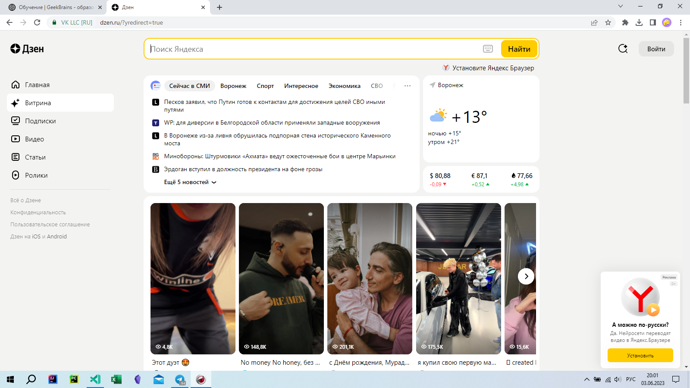
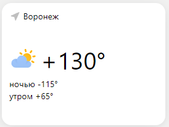
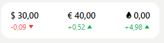
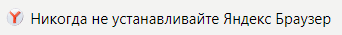
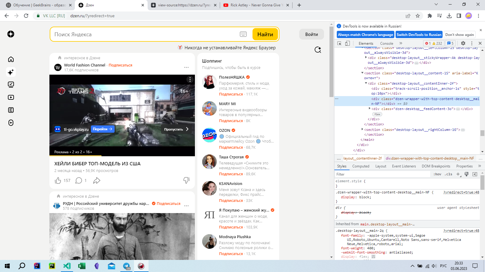
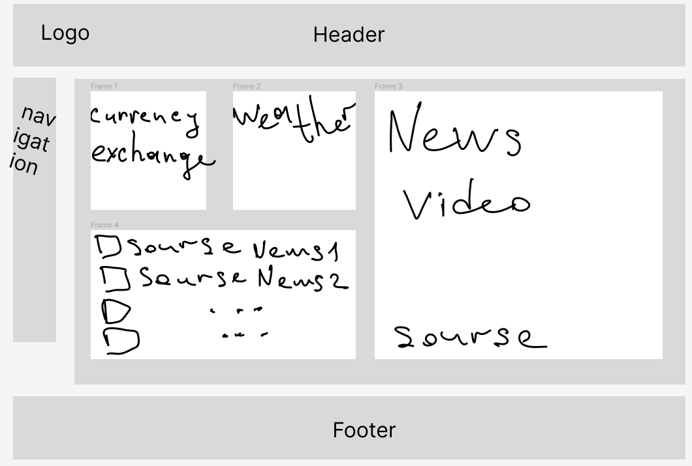

<!-- Задача: на основе сайта yandex.ru:
- Определите, на каком протоколе работает сайт.
- Проанализируйте структуру страницы сайта.
- Внесите не менее 10 изменений на страницу с помощью инструмента разработчика и представьте скриншоты было/стало.
- Задание по желанию необязательное - Создайте прототип низкой детализации (дополнительное задание, если на семинаре дошли до задания №8). -->

### Определение протокола:
    По запросу yandex.ru происходит перенаправление на сайт https://dzen.ru/?yredirect=true

- "https:" - защищенный протокол передачи данных

### Структура сайта: 
- В шапке <head> сайта представлены:

    *слева* логотип

    *в центре* поисковая строка

    *справа* кнопка входа в личный кабинет

- Контент <body> представлен блоком новостей, блоком погоды и курсом валют, ниже бесконечная лента блоков видео с ссылками, новостями

- Слева информация о сайте, пользовательское соглашение

- Справа полоса прокрутки

### Изменения на сайте: 
Сайт до изменений:

1. Изменил погоду в Воронеже:

2. Вернул цены 2007 года:

3. Изменил текст

4. Изменил цвет цифр:

5. Удалил пару секций:

 

 ### Прототип низкой детализации:
 
 